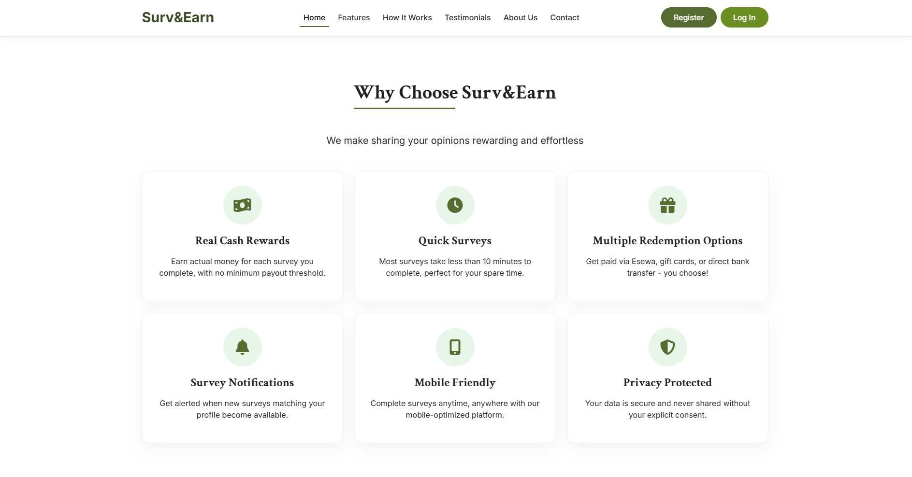
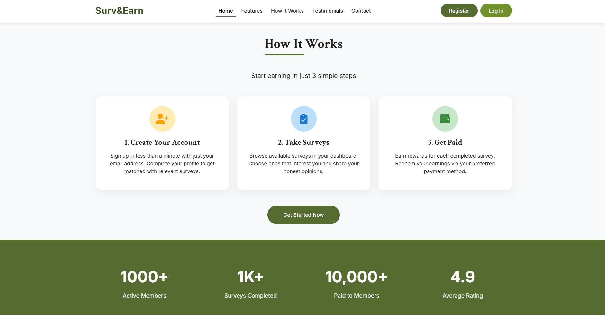
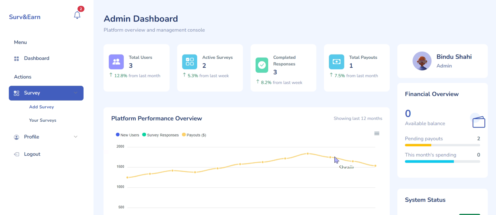
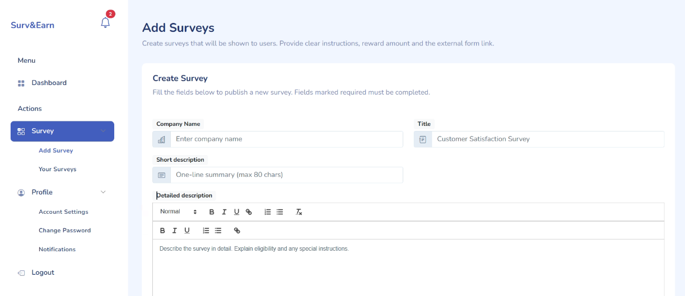
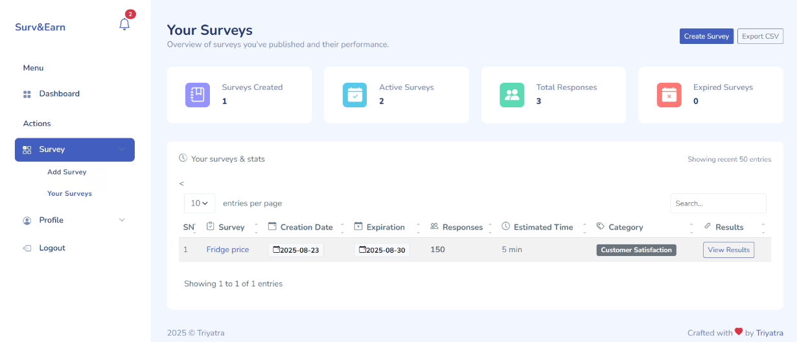
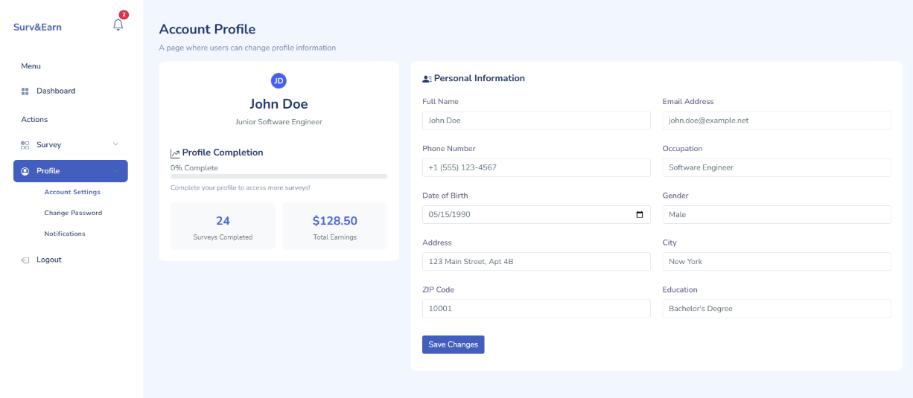
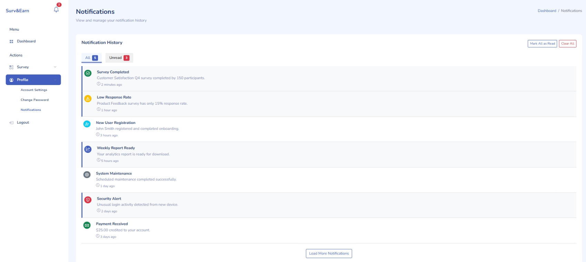

# Surv&Earn


Surv&Earn is an innovative platform designed to empower freelance enthusiasts by providing opportunities to contribute to research while
earning pocket money. Our mission is to bridge the gap between businesses seeking valuable insights and individuals looking for flexible
earning opportunities.

---

## Why Choose Surv&Earn?

- **Empowering Freelancers**: Earn money in your spare time by participating in surveys.
- **Research Contribution**: Help businesses make informed decisions with your opinions.
- **Flexible Earnings**: Redeem your earnings via multiple options, including Esewa, gift cards, or direct bank transfer.
- **User-Friendly Interface**: Intuitive and accessible design for all users.
- **Secure and Private**: Your data is protected and never shared without consent.

---

## Setup Instructions

Follow these steps to set up and run the project:

0. **Setup Mongodb**:
    1. **Either install mongodb locally OR Setup mongodb atlas cluster.** [More Info](https://mongodb.com)
    2. **Get you mongodb URI either localhost or atlas.**

1. **Create Secret Env File**
    1. **create a file named `.env` inside `src` folder.**
    2. **Put this inside the `.env` file.**
       ```
       SECRET_KEY="<yoursecretkey"
       MAIL_SERVER="smtp.gmail.com" # you can use any smtp server
       MAIL_USERNAME="<youremail@gmail.com>"
       MAIL_PASSWORD="<youremailpassword>"
       MAIL_DEFAULT_SENDER="<youremail@gmail.com>
       MONGO_URI="<yourmongodburi>" # for local db uri is "mongodb://localhost:27017/" 
       ```

2. **Clone the Repository**:
   ```bash
   git clone https://github.com/Tejas-Bipu-Shahi/Surv-Earn.git
   cd surv-earn
   ```

3. **Create a Virtual Environment**:
   ```bash
   python -m venv venv
   ```

4. **Activate Virtual Environment**:
    - **Powershell**:
         ```bash
         venv\Scripts\activate.ps1
         ```
    - **CMD Prompt**:
        ```bash
        venv\Scripts\activate.bat
        ```
    - **sh / bash / zsh / fish**:
         ```bash
         source venv/bin/activate
         ```

5. **Install Dependencies**:
   ```bash 
   pip install flask flask-pymongo flask-login flask-mail dotenv bcrypt "pydantic[email]" icecream
   ```

6. **Run the Application**:
   ```bash
   python src/main.py
   ```

7. **Access the Application**:
   Open your browser and navigate to `http://localhost:5000`.

---

## Visual Preview

### Home Page


### Features



### How It Works



### Admin Dashboard



Admin Dashboard also provides features like adding survey and viewing your survey history.
<table>
  <tr>
    <td>
      
    </td>
    <td>
      
    </td>
  </tr>
  <tr>
    <td align="center">
      <em>You can add your surveys as a client</em>
    </td>
    <td align="center">
      <em>You can also view your survey history</em>
    </td>
  </tr>
</table>

### User Profile



### Notifications



### About Us

.png)

<table>
  <tr>
    <td>
      
    </td>
    <td>
      
    </td>
  </tr>
  <tr>
    <td align="center">
      <em>About Us landing page</em>
    </td>
    <td align="center">
      <em>Meet the team</em>
    </td>
  </tr>
</table>

---

## Contributors

<table style="width:100%; text-align:center;">
  <tr>
    <td style="vertical-align:top;">
      
      <br/>
      <a href="https://github.com/Tejas-Bipu-Shahi">Tejas Shahi</a>
    </td>
    <td style="vertical-align:top;">
      
      <br/>
      <a href="https://github.com/Nick-Zoc">Naitik Joshi</a>
    </td>
    <td style="vertical-align:top;">
      
      <br/>
      <a href="https://github.com/Alwin-Kuri">Alwin Maharjan</a>
    </td>
    <td style="vertical-align:top;">
      
      <br/>
      <a href="https://github.com/nityayada">Nitya Yadav</a>
    </td>
    <td style="vertical-align:top;">
      
      <br/>
      <a href="https://github.com/Sambhu69">Sambhav Shrestha</a>
    </td>
  </tr>
</table>

---

## 🌐 Demo

Experience Surv&Earn live: [https://surv-earn.onrender.com/](https://surv-earn.onrender.com/)

---

Thank you for exploring Surv&Earn. Join us in shaping the future while earning rewards for your valuable opinions!